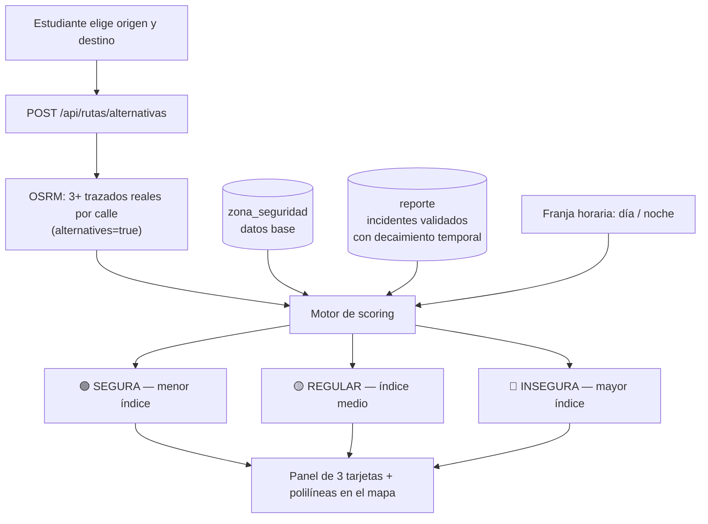
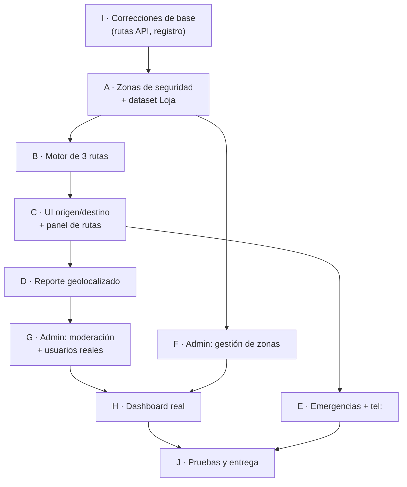

# 🛠️ Plan de Implementación V2 — SafeWalk U

> Reemplaza al `implementation_plan.md` anterior. Incorpora los requerimientos nuevos del cliente
> (rutas alternativas por nivel de seguridad, origen/destino manual, reporte geolocalizado por el
> usuario, llamadas reales desde móvil) **y** absorbe las épicas pendientes del plan original.

**Fecha:** 31 de julio de 2026
**Stack actual:** React 19 + Vite 8 + Tailwind 4 + Leaflet · Express 4 + TypeScript + MySQL/MariaDB · JWT

---

## 1. Diagnóstico del estado actual

Revisión hecha sobre el código real del repositorio.

### ✅ Lo que ya funciona
| Área | Estado |
|---|---|
| Autenticación JWT + roles (`ESTUDIANTE` / `ADMINISTRADOR`) | Funcional (`auth.*`, `PrivateRoute.jsx`) |
| Mapa Leaflet con GPS en vivo (`watchPosition`) y marcador arrastrable | Funcional (`MapaInteractivo.jsx`) |
| CRUD de reportes en backend + endpoint de zonas de riesgo | Funcional (`report.*`) |
| SOS: creación y cancelación | Funcional pero con ubicación fija |
| Búsqueda de ubicaciones en BD | Funcional (`GET /api/ubicaciones/buscar`) |
| Métricas del dashboard admin | Funcional (4 contadores reales) |
| Swagger, rate-limit, Multer configurado, Docker/nginx | Presentes |

### ❌ Brechas críticas detectadas

| # | Hallazgo | Evidencia |
|---|---|---|
| B1 | **No existe motor de rutas.** `trazarRuta()` devuelve una polilínea de 3 puntos inventada, con `tiempo_estimado: 5` y `distancia_m: 500` **hardcodeados**. | `backend/src/repositories/route.repository.ts:269-289` |
| B2 | **No hay rutas alternativas.** No existe el concepto de ruta segura/regular/insegura calculada. | — |
| B3 | **El origen no se puede elegir.** El input de origen está `disabled` con el texto fijo *"Mi ubicación actual (UIDE Loja)"*. | `src/components/BuscadorPrincipal.jsx:60-65` |
| B4 | **Endpoint mal llamado.** El frontend pide `/api/rutas/trazar` pero el backend monta `/api/routes`. La función nunca responde. | `src/pages/StudentApp.jsx:71` vs `backend/src/routes/index.ts:26` |
| B5 | **No existe tabla de zonas de seguridad.** El nivel de seguridad vive en la tabla `ruta` (rutas fijas precargadas), no en zonas geográficas. | `backend/db/schema.sql:168-175` |
| B6 | **Reportar Incidente no llega al backend.** Guarda en `localStorage` y usa la coordenada fija `[-3.9835, -79.2022]`. | `src/components/ReportarIncidente.jsx:16, 64` |
| B7 | **El usuario no puede elegir dónde ocurrió el incidente.** No hay selector de punto en el mapa. | — |
| B8 | **Los botones de llamar no llaman.** Ejecutan `alert()` en vez de abrir el marcador telefónico. | `src/components/ListaContactosApoyo.jsx:30-32` |
| B9 | **Gestión de Usuarios es maqueta.** 4 usuarios ficticios en `INITIAL_USERS`, botón "Nuevo Usuario" dispara un `alert('próximamente')`. | `src/components/GestionUsuarios.jsx:3-8, 45` |
| B10 | **Historial de Alertas es maqueta.** 6 alertas fijas en `ALL_ALERTS`. | `src/components/HistorialNotificaciones.jsx:3-9` |
| B11 | **Dashboard con gráfico y mapa falsos.** Pie con `conic-gradient` fijo, total "128" escrito a mano, "mapa" = imagen de Google. | `src/pages/AdminDashboard.jsx:216-221, 240-244` |
| B12 | **Configuración del admin no persiste.** `handleSave()` solo hace `console.info`. | `src/components/AdminSettings.jsx:25-29` |
| B13 | **SOS con ubicación fija.** Envía `id_ubicacion: 1` siempre. | `src/components/EmergenciaSos.jsx:57` |
| B14 | Servicios de emergencia, contactos personales y lugares seguros: tablas existen, **sin endpoints ni UI**. | `schema.sql` vs `routes/index.ts` |
| B15 | `poblarCalles()` inserta en `calle_segmento`, tabla que **no está en `schema.sql`**. | `route.repository.ts:237` |

---

## 2. Requerimientos del cliente → cobertura

| Requerimiento del cliente | Cubierto por |
|---|---|
| Detectar mi ubicación actual | Épica A (ya parcial, se consolida) |
| Elegir destino y recibir **3 caminos: seguro / regular / inseguro** | **Épica B + C** (nuevo, núcleo del proyecto) |
| Criterios basados en zonas seguras/inseguras/normales de Loja | **Épica A** (modelo de datos + dataset) |
| Elegir origen **y** destino manualmente sin GPS | **Épica C** |
| Reportar incidente en una ubicación **elegida por el usuario** | **Épica D** |
| Revisión de funcionalidades del administrador | **Épicas F, G, H** |
| Llamar a números de emergencia desde el celular | **Épica E** |

---

## 3. Arquitectura de la solución de rutas



### Algoritmo de scoring (resumen)

1. **Obtener candidatos.** Llamada a OSRM con `alternatives=true` (hasta 3 trazados reales por calle).
   Si OSRM devuelve menos de 3, se generan variantes forzando un *waypoint* intermedio: uno en el
   centroide de la zona segura más cercana al corredor, otro en el de la zona de riesgo más cercana.
   Esto **garantiza siempre 3 opciones diferenciadas**.
2. **Muestreo.** Cada trazado se discretiza en puntos cada ~30 m.
3. **Riesgo estático.** Para cada punto, se busca la zona que lo contiene (haversine ≤ `radio_metros`)
   y se toma su peso: `SEGURA = 1`, `REGULAR = 4`, `INSEGURA = 10`, sin zona = `2` (desconocido).
   Si la zona es nocturna y la consulta es entre 18:00 y 06:00, el peso se multiplica por `factor_nocturno`.
4. **Riesgo dinámico (reportes de usuarios).** Cada reporte `VALIDADO` de los últimos 90 días suma
   riesgo en un radio de 150 m, con decaimiento temporal `e^(-días/30)` y peso por `nivel_riesgo`.
   → **Los reportes de los estudiantes modifican realmente las rutas sugeridas.** Es el argumento
   de venta más fuerte del sistema.
5. **Índice final.** `indice = Σ(peso_tramo × longitud_tramo) / longitud_total`, normalizado a 0–100.
6. **Clasificación.** Se ordenan los 3 candidatos por índice ascendente → `SEGURA`, `REGULAR`, `INSEGURA`.
   Se devuelve además distancia, duración a pie, zonas atravesadas y nº de incidentes cercanos.

### Contrato del endpoint nuevo

```http
POST /api/rutas/alternativas
Authorization: Bearer <token>
Content-Type: application/json

{
  "origen":  { "lat": -3.97410, "lng": -79.20310 },
  "destino": { "lat": -3.99620, "lng": -79.20360 },
  "hora":    "2026-07-31T21:15:00-05:00",   // opcional, default = ahora
  "modo":    "walking"                       // walking | driving
}
```

```jsonc
{
  "success": true,
  "data": [
    {
      "clasificacion": "SEGURA",
      "indice_riesgo": 18,          // 0-100
      "distancia_m": 2140,
      "duracion_min": 27,
      "color": "#16a34a",
      "coordenadas": [[lat,lng], ...],
      "zonas_atravesadas": [
        { "nombre": "Corredor Av. Salvador Bustamante Celi", "nivel": "SEGURA" }
      ],
      "incidentes_cercanos": 0,
      "recomendacion": "Ruta iluminada y con presencia de UPC. Recomendada de noche.",
      "advertencias": []
    },
    { "clasificacion": "REGULAR",  "...": "..." },
    { "clasificacion": "INSEGURA", "...": "..." }
  ]
}
```

---

## 4. Modelo de datos nuevo

```sql
-- ────────────────────────────────────────────────────────────────
-- ZONAS DE SEGURIDAD (núcleo del motor de rutas)
-- ────────────────────────────────────────────────────────────────
CREATE TABLE zona_seguridad (
  id_zona           INT AUTO_INCREMENT PRIMARY KEY,
  nombre            VARCHAR(120)  NOT NULL,
  descripcion       VARCHAR(255)  NULL,
  sector            VARCHAR(100)  NULL,
  ciudad            VARCHAR(100)  NOT NULL DEFAULT 'Loja',
  nivel             ENUM('SEGURA','REGULAR','INSEGURA') NOT NULL,
  peso_riesgo       DECIMAL(4,2)  NOT NULL DEFAULT 4.00,
  centro_lat        DECIMAL(10,8) NOT NULL,
  centro_lng        DECIMAL(11,8) NOT NULL,
  radio_metros      INT           NOT NULL DEFAULT 250,
  franja_horaria    ENUM('DIURNO','NOCTURNO','AMBOS') NOT NULL DEFAULT 'AMBOS',
  factor_nocturno   DECIMAL(3,2)  NOT NULL DEFAULT 1.00,
  fuente            VARCHAR(120)  NULL,   -- trazabilidad del dato
  estado            ENUM('ACTIVO','INACTIVO') NOT NULL DEFAULT 'ACTIVO',
  creado_por        INT NULL,
  fecha_creacion    DATETIME DEFAULT CURRENT_TIMESTAMP,
  fecha_actualizacion DATETIME DEFAULT CURRENT_TIMESTAMP ON UPDATE CURRENT_TIMESTAMP,
  INDEX idx_zona_nivel (nivel, estado),
  INDEX idx_zona_geo (centro_lat, centro_lng),
  CONSTRAINT zona_fk_admin FOREIGN KEY (creado_por) REFERENCES usuario(id_usuario)
);

-- Caché de trazados ya calculados (evita saturar OSRM y acelera la demo)
CREATE TABLE ruta_calculada (
  id_calculo      INT AUTO_INCREMENT PRIMARY KEY,
  hash_consulta   CHAR(64) NOT NULL UNIQUE,   -- sha256(origen|destino|modo|franja)
  respuesta_json  JSON NOT NULL,
  fecha_calculo   DATETIME DEFAULT CURRENT_TIMESTAMP,
  INDEX idx_hash (hash_consulta)
);

-- Historial de rutas usadas (alimenta estadísticas del admin)
CREATE TABLE ruta_historial (
  id_historial    INT AUTO_INCREMENT PRIMARY KEY,
  id_usuario      INT NOT NULL,
  origen_lat      DECIMAL(10,8) NOT NULL,
  origen_lng      DECIMAL(11,8) NOT NULL,
  destino_lat     DECIMAL(10,8) NOT NULL,
  destino_lng     DECIMAL(11,8) NOT NULL,
  clasificacion_elegida ENUM('SEGURA','REGULAR','INSEGURA') NOT NULL,
  indice_riesgo   DECIMAL(5,2) NOT NULL,
  fecha           DATETIME DEFAULT CURRENT_TIMESTAMP,
  CONSTRAINT hist_fk_user FOREIGN KEY (id_usuario) REFERENCES usuario(id_usuario)
);

-- Falta en schema.sql aunque el código ya la usa (B15)
CREATE TABLE IF NOT EXISTS calle_segmento (
  id_segmento     INT AUTO_INCREMENT PRIMARY KEY,
  id_ubicacion    INT NOT NULL,
  nivel_seguridad ENUM('BAJO','MEDIO','ALTO') NOT NULL,
  coordenadas     JSON NOT NULL,
  CONSTRAINT calle_fk_ubi FOREIGN KEY (id_ubicacion) REFERENCES ubicacion(id_ubicacion)
);
```

### Campos a agregar en tablas existentes

```sql
ALTER TABLE reporte
  ADD COLUMN categoria ENUM('ROBO','ACOSO','ACTIVIDAD_SOSPECHOSA','ILUMINACION',
                            'ACCIDENTE','VIOLENCIA','OTRO') NOT NULL DEFAULT 'OTRO' AFTER descripcion,
  ADD COLUMN es_anonimo TINYINT(1) NOT NULL DEFAULT 0,
  ADD COLUMN observacion_admin VARCHAR(255) NULL;

ALTER TABLE usuario
  ADD COLUMN telefono VARCHAR(20) NULL,
  ADD COLUMN carrera  VARCHAR(100) NULL,
  ADD COLUMN matricula VARCHAR(30) NULL;
```

---

## 5. Dataset de zonas de Loja (datos simulados)

> [!WARNING]
> **Estos datos son ficticios**, creados para que la demo funcione y sea evaluable.
> No provienen de estadísticas de la Policía Nacional ni del ECU 911. Antes de cualquier
> uso real deben validarse con fuentes oficiales, porque etiquetar barrios reales como
> "inseguros" tiene consecuencias reputacionales y legales. En la UI y en el seed se
> marcan con `fuente = 'DATO SIMULADO - DEMO ACADÉMICA'`.

**24 zonas** distribuidas así:

| Nivel | Cant. | Peso | Ejemplos del dataset |
|---|:--:|:--:|---|
| 🟢 SEGURA | 8 | 1.0 | Campus UIDE y Av. Salvador Bustamante Celi · Parque Jipiro (diurno) · Puerta de la Ciudad · Corredor Av. Universitaria · Sauces Norte residencial · Entorno UPC Jipiro · Centro Comercial Loja · Parque Recreacional Jipiro Norte |
| 🟡 REGULAR | 9 | 4.0 | Centro Histórico · Terminal Terrestre (diurno) · Daniel Álvarez · Belén · La Tebaida Baja · Época · Motupe · Clodoveo Jaramillo · Estadio Reina del Cisne |
| 🔴 INSEGURA | 7 | 10.0 | Riberas del Río Malacatos (tramo nocturno) · Zona Rosa Bolívar–24 de Mayo (noche) · Vía a Zamora / Túnel de los Ahorcados · Punzara Alto · Periferia Las Pitas · Chontacruz vía antigua · Entorno Terminal en madrugada |

Cinco zonas llevan `franja_horaria = 'NOCTURNO'` con `factor_nocturno` entre 1.8 y 2.5, de modo que
**la misma ruta cambia de clasificación según la hora**. Es el efecto más vistoso para la demo al cliente.

Archivo a crear: `backend/db/seed_zonas.sql` (~24 INSERT + 12 servicios/lugares seguros).

---

## 6. Épicas de trabajo

### 🅰️ Épica A — Modelo de zonas de seguridad y datos base
| # | Tarea | Tipo |
|---|---|---|
| A1 | Migración `001_zonas_seguridad.sql` con las 4 tablas nuevas y los `ALTER TABLE` | NEW |
| A2 | `seed_zonas.sql`: 24 zonas de Loja + 12 servicios de emergencia + 8 lugares seguros | NEW |
| A3 | `zona.repository.ts` / `zona.service.ts` / `zona.controller.ts` / `zona.routes.ts` — CRUD completo | NEW |
| A4 | `GET /api/zonas` (auth) · `GET /api/zonas/cercanas?lat&lng&radio` · `POST/PUT/DELETE` (solo admin) | NEW |
| A5 | Utilidades geo: `haversine`, `puntoEnZona`, `interpolarPolilinea`, `bboxLoja` | NEW `utils/geo.ts` |

**Estimación: 8 h**

---

### 🅱️ Épica B — Motor de rutas alternativas (backend)
| # | Tarea | Tipo |
|---|---|---|
| B1 | `services/osrm.service.ts`: cliente OSRM con `alternatives=true`, timeout, reintento y fallback | NEW |
| B2 | `services/scoring.service.ts`: muestreo, riesgo estático por zona, riesgo dinámico por reportes con decaimiento, penalización nocturna, índice 0–100 | NEW |
| B3 | Generador de variantes por *waypoint* cuando OSRM devuelve < 3 alternativas | NEW |
| B4 | `POST /api/rutas/alternativas` + caché en `ruta_calculada` (TTL 6 h) | NEW |
| B5 | `POST /api/rutas/historial` para registrar la ruta elegida | NEW |
| B6 | **Corregir B4 del diagnóstico**: alias de montaje `/api/rutas` → mismo router que `/api/routes` | MODIFY `routes/index.ts` |
| B7 | Reemplazar el `trazarRuta()` falso por el motor real | MODIFY `route.repository.ts` |
| B8 | Documentación Swagger de los endpoints nuevos | MODIFY |

**Estimación: 14 h** ← *tarea de mayor riesgo técnico*

---

### 🅲 Épica C — Selección de origen/destino y UI de rutas
| # | Tarea | Tipo |
|---|---|---|
| C1 | `GET /api/ubicaciones/geocodificar?q=` — proxy a Nominatim acotado al *bounding box* de Loja, con caché y `User-Agent` (cumple la política de uso de OSM) | NEW backend |
| C2 | `GET /api/ubicaciones/reversa?lat&lng` — dirección legible a partir de un punto | NEW backend |
| C3 | Rediseño de `BuscadorPrincipal.jsx`: **dos campos** (origen + destino), botón "Usar mi GPS", botón "Elegir en el mapa", intercambio origen↔destino, autocompletado mixto (BD + Nominatim) | MODIFY |
| C4 | Modo "picker" en `MapaInteractivo.jsx`: clic en el mapa fija el punto, pin arrastrable, reverse-geocode automático | MODIFY |
| C5 | **`PanelRutas.jsx` nuevo**: 3 tarjetas estilo Google Maps (verde/ámbar/rojo) con distancia, tiempo a pie, índice de riesgo, zonas atravesadas y advertencias; al seleccionar una, se resalta su polilínea | NEW |
| C6 | Dibujo simultáneo de las 3 polilíneas (2 atenuadas + 1 resaltada), leyenda y `fitBounds` automático | MODIFY `MapaInteractivo.jsx` |
| C7 | Capa opcional de zonas: círculos verde/ámbar/rojo con `Circle` de Leaflet + interruptor "Ver zonas" | MODIFY |
| C8 | Estados de carga, error y "sin resultados" | MODIFY |

**Estimación: 16 h**

---

### 🅳 Épica D — Reporte de incidentes geolocalizado y real
| # | Tarea | Tipo |
|---|---|---|
| D1 | `POST /api/ubicaciones` — crea `ubicacion` + `coordenada` en una transacción y devuelve `id_ubicacion` | NEW |
| D2 | `ReportarIncidente.jsx`: selector de ubicación con 3 modos — **GPS actual**, **tocar el mapa**, **buscar dirección**; muestra la dirección resuelta | MODIFY |
| D3 | Mapeo categoría → `nivel_riesgo` (Robo/Violencia → ALTO, Acoso/Sospechoso → MEDIO, Iluminación → BAJO) y persistencia de la categoría | MODIFY + backend |
| D4 | Envío real: `POST /api/reports` con `id_ubicacion` creado, eliminando el `localStorage` | MODIFY |
| D5 | Subida real de evidencia (foto) vía Multer a `POST /api/evidencias` con validación de tipo y tamaño (máx. 5 MB) | MODIFY |
| D6 | Casilla "Reportar de forma anónima" | NEW |
| D7 | `ResumenReporte.jsx`: mostrar el reporte devuelto por el backend, con nº de ticket y estado `PENDIENTE` | MODIFY |
| D8 | "Mis reportes" en el perfil, con estado de cada uno | NEW |

**Estimación: 10 h**

---

### 🅴 Épica E — Emergencias, llamadas reales y contactos
| # | Tarea | Tipo |
|---|---|---|
| E1 | `servicio.routes/controller/service/repository` — CRUD de servicios de emergencia | NEW backend |
| E2 | `contacto.routes/controller/service/repository` — CRUD de contactos personales del estudiante (`GET /api/contactos/me`) | NEW backend |
| E3 | `ListaContactosApoyo.jsx`: cargar servicios desde la API y **reemplazar `alert()` por `<a href="tel:...">`**, con detección de móvil y fallback a copiar el número en escritorio | MODIFY |
| E4 | Botón de llamada rápida flotante y `tel:911` directo en la pantalla SOS | MODIFY `EmergenciaSos.jsx` |
| E5 | Sección "Mis contactos de emergencia" en el perfil (agregar/editar/eliminar con parentesco) | MODIFY `PerfilEstudiante.jsx` |
| E6 | **SOS con ubicación real** (arregla B13): crear ubicación dinámica antes del POST | MODIFY `EmergenciaSos.jsx` + `report.controller.ts` |
| E7 | `lugarseguro` endpoints + marcadores verdes en el mapa con distancia al usuario | NEW |
| E8 | Servicios reales de Loja en el seed: ECU 911, UPC Jipiro, Bomberos, Hospital Isidro Ayora, Cruz Roja 131 | NEW |

**Estimación: 10 h**

---

### 🅵 Épica F — Admin: gestión de zonas de seguridad (módulo nuevo)
> Sin este módulo el administrador no puede mantener el criterio que alimenta las rutas.
> Es la funcionalidad administrativa **más importante** que hoy no existe.

| # | Tarea | Tipo |
|---|---|---|
| F1 | `GestionZonas.jsx`: mapa Leaflet a pantalla completa con todas las zonas dibujadas por color | NEW |
| F2 | Crear zona: clic en el mapa → formulario (nombre, sector, nivel, radio con *slider* en vivo, franja horaria, descripción) | NEW |
| F3 | Editar / mover / redimensionar / desactivar zona | NEW |
| F4 | Tabla lateral con filtros por nivel y sector, y buscador | NEW |
| F5 | Vista "impacto": cuántos reportes validados caen dentro de cada zona | NEW |
| F6 | Ruta `/admin/zonas` + entrada en el menú lateral | MODIFY `App.jsx` + layout |

**Estimación: 10 h**

---

### 🅶 Épica G — Admin: usuarios y moderación de reportes reales
| # | Tarea | Tipo |
|---|---|---|
| G1 | `GestionUsuarios.jsx`: eliminar `INITIAL_USERS`, consumir `GET /api/users`, búsqueda y filtro por rol sobre datos reales, paginación | MODIFY |
| G2 | Modal de crear usuario (`POST /api/auth/register`) y de editar (`PUT /api/users/:id`) | NEW |
| G3 | Activar/desactivar usuario (soft delete) con confirmación | MODIFY |
| G4 | `HistorialNotificaciones.jsx`: eliminar `ALL_ALERTS`, consumir `GET /api/reports` con filtros por tipo/estado/fecha | MODIFY |
| G5 | **Moderación**: validar / rechazar / marcar duplicado un reporte, con observación del admin. Solo los `VALIDADO` afectan las rutas | NEW |
| G6 | Ver evidencia adjunta del reporte en un visor modal | NEW |
| G7 | Exportar reportes a CSV | NEW |

**Estimación: 9 h**

---

### 🅷 Épica H — Admin: dashboard con datos reales
| # | Tarea | Tipo |
|---|---|---|
| H1 | `dashboard.service.ts`: consultas de reportes por estado, por categoría, por día (últimos 30), top 5 zonas con más incidentes, rutas más consultadas | MODIFY |
| H2 | Gráfico de estados con datos reales (reemplaza el `conic-gradient` fijo) | MODIFY |
| H3 | Gráfico de barras: incidentes por categoría | NEW |
| H4 | **Mapa de calor real con Leaflet** de los reportes activos (reemplaza la imagen de Google) | MODIFY |
| H5 | Tendencias calculadas contra el período anterior (reemplaza "+12%", "+28" escritos a mano) | MODIFY |
| H6 | `AdminSettings.jsx`: persistir configuración en tabla `configuracion` o retirar los controles que sean maqueta | MODIFY |

**Estimación: 8 h**

---

### 🅸 Épica I — Correcciones de base y experiencia móvil
| # | Tarea |
|---|---|
| I1 | Arreglar registro: campos `nombre`/`apellido`, quitar el `catch` que simula éxito, validar dominio `@uide.edu.ec`, modo oscuro |
| I2 | Corregir el desfase `/api/rutas` vs `/api/routes` en todo el frontend |
| I3 | Perfil del estudiante: datos reales (teléfono, carrera, matrícula) y estadísticas calculadas desde la BD |
| I4 | Decidir sobre `RutaSegura.jsx` (integrar o eliminar) |
| I5 | Responsive real en móvil: mapa a pantalla completa, panel deslizable (*bottom sheet*), áreas táctiles ≥ 44 px |
| I6 | `manifest.json` + iconos + `theme-color` → instalable como app desde el navegador del celular |
| I7 | HTTPS en desarrollo (`@vitejs/plugin-basic-ssl` ya está instalado) — obligatorio para que el GPS funcione en el celular |
| I8 | Enlaces "¿Olvidaste tu contraseña?" y "Soporte TI": implementar o retirar |
| I9 | Manejo de errores unificado y *toasts* en lugar de `alert()` |

**Estimación: 10 h**

---

### 🅹 Épica J — Pruebas, documentación y entrega
| # | Tarea |
|---|---|
| J1 | Pruebas manuales guiadas por casos de uso (matriz de 40 casos) |
| J2 | Pruebas en dispositivo móvil real: GPS, llamadas `tel:`, gestos en el mapa |
| J3 | Pruebas de los 3 escenarios de ruta: día, noche y con reportes recién validados |
| J4 | Actualizar Swagger y `README.md` |
| J5 | Manual de usuario (estudiante) y manual de administrador, en PDF |
| J6 | Script de despliegue y verificación del `Dockerfile` / `nginx.conf` |
| J7 | Sesión de capacitación y entrega |

**Estimación: 9 h**

---

## 7. Resumen de esfuerzo

| Épica | Descripción | Horas |
|:--:|---|:--:|
| A | Modelo de zonas de seguridad y datos base | 8 |
| B | Motor de rutas alternativas (backend) | 14 |
| C | Selección origen/destino + UI de 3 rutas | 16 |
| D | Reporte de incidentes geolocalizado | 10 |
| E | Emergencias, llamadas `tel:` y contactos | 10 |
| F | Admin — gestión de zonas de seguridad | 10 |
| G | Admin — usuarios y moderación de reportes | 9 |
| H | Admin — dashboard con datos reales | 8 |
| I | Correcciones de base y experiencia móvil | 10 |
| J | Pruebas, documentación y entrega | 9 |
| | **TOTAL** | **104 h** |

Con un margen de contingencia del 10 % (integración con OSRM/Nominatim, que son servicios externos
gratuitos y pueden fallar): **≈ 114 h**.

---

## 8. Orden de ejecución



**Criterio:** primero se arregla lo roto, luego se construyen los datos que alimentan el motor,
después el motor, después la interfaz que lo consume, y al final el panel administrativo que lo mantiene.

---

## 9. Riesgos y mitigaciones

| Riesgo | Impacto | Mitigación |
|---|:--:|---|
| El servidor público de OSRM limita peticiones o cae | Alto | Caché en `ruta_calculada`, *fallback* a trazado directo, opción de OSRM propio en Docker |
| Nominatim limita a 1 petición/segundo | Medio | Proxy en backend con caché, *debounce* de 400 ms, `User-Agent` identificado |
| GPS impreciso en interiores (±50 m) | Medio | Marcador arrastrable (ya implementado) + selección manual |
| El GPS no funciona sin HTTPS en el celular | Alto | HTTPS en desarrollo y producción (tarea I7) |
| Datos de zonas ficticios cuestionados en la defensa | Medio | Etiquetado explícito como simulados + módulo admin para cargar datos reales |
| MySQL vs MariaDB (hay dos schemas en el repo) | Medio | Migraciones compatibles con ambos, probadas en los dos motores |

---

## 10. Fuera de alcance (fase 2 sugerida)

- Compartir ubicación en tiempo real con un contacto (tabla `compartirubicacion` ya existe)
- Rutas favoritas (tabla `rutafavorita` ya existe)
- Notificaciones push / correo al administrador ante un SOS
- Recuperación de contraseña por correo (requiere SMTP)
- App nativa iOS/Android
- Integración con la API oficial del ECU 911
